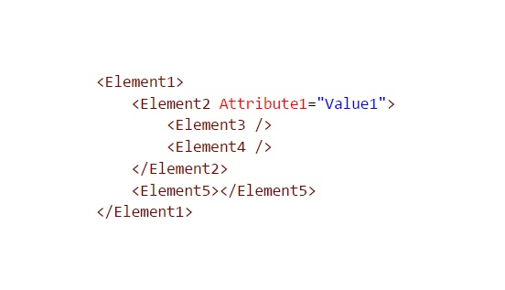
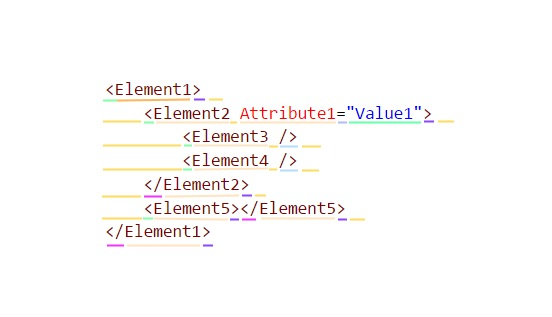
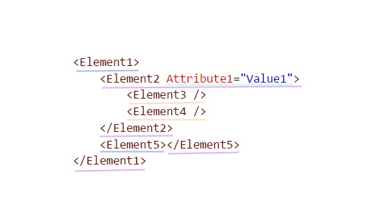

<!-- $theme: default -->

# How does Intellisense work?

---

## What is Intellisense?

---

## Types of Intellisense

* Contextual
* Global

---

## Contextual Intellisense

* Completions
* Tooltips
  * Signature help
  * Quick info
* Go to definition
* CodeLense
* Editor decorations
  * Red squiggle on invalid syntax

---

## Global intellisense

* Diagnostics (i.e. errors and warnings)
* Go to symbol
* Find all references

---

# A side-trip: Compilers

Most compilers have 4 stages:

* Lexical analysis (often called _lexing_)  
  Processing the source text into a sequence of _tokens_.
* Syntax analysis (often called _parsing_)  
  Parsing the tokens to produce a syntactic model, usually an _Abstract Syntax Tree_ (AST).
* Semantic analysis  
  Analysing the syntactic model to determine what things _mean_.  
  The semantic model varies from language to language.
* Generation (generate appropriate artifacts)

---

## Worked example (simplified)

---

## Lexical analysis

The lexer turns a stream of characters into discrete tokens:

Before: `_count == 5`

After:
* `Identifier(_count)`
* `Whitespace( )`
* `Operator(==)`
* `Whitespace( )`
* `IntegerLiteral(5)`

---

## Syntactic analysis

The parser turns a stream of tokens into an AST.

Before:
* `Identifier(_count)`
* `Whitespace( )`
* `Operator(==)`
* `Whitespace( )`
* `IntegerLiteral(5)`

After:
* `EqualityExpression`
  * `Left`: `Symbol(_count)`
  * `Right`: `IntegerLiteral(5)`

---

## Semantic analysis

The compiler refines and interprets the AST.

Before:
* `EqualityExpression`
  * `Left`: `Symbol(_count)`
  * `Right`: `IntegerLiteral(5)`

After:
* `Equality(ExpressionType:Boolean)`
  * `Left`: `Field(Class1::_count), Type=Symbol(Int32), Target=This`
  * `Right`: `Int32Literal(5)`

---

## Compiler vs. Language Service

* A compiler's job is to _transform_ the source text and _generate outputs_.
* A language service's job is to _understand_ the source text and _answer questions_ about it.

---

### The Compiler's job

* `'Foo.cs' -> 'Foo.exe'`
* `'Strings.resx' -> 'Strings.resources'`

---

### The Language service's job

* "What does the identifier at line 3, column 6 mean?"
* "Where is the class `HomeController` used?"

---

### Some source text

---

#### Let's put on our language-service goggles!

What does the language service see?

---

### Tokens

---

### Syntax

---

## Quick side-trip
#### The cross-platform problem

---

#### The cross-platform problem

Many editors / IDEs can be used for multiple languages, even when those languages are built for a different platform / runtime than the one used by those editors, so the editor can't simply load the library that implements each language service.

---

#### An example of the cross-platform problem

* VSCode is written in TypeScript, and runs on Electron / NodeJS
* The C# compiler is written in managed code and runs on the CLR

So how do we provide a C# language service for VSCode?

---

#### An example of the cross-platform problem

* The Go compiler is written in Go and runs natively

So how do we provide a Go language service for VSCode?

---

## Language Server Protocol (LSP)

Microsoft have developed a [standard protocol](https://github.com/Microsoft/language-server-protocol) for communications between editors and language services.

Think of it as a WebAPI for Intellisense (without the "web" bit).

---

## OmniSharp

OmniSharp is an out-of-process language server that brings C# to a large number of editors. It does not currently use LSP (mainly because it existed long before LSP) but there are definite similarities.

---

## Models for Intellisense

* Syntactic model
* Semantic model

---

### Syntactic model

The syntactic model is essential for providing contextual Intellisense; it is used to map text (i.e. editor) positions to nodes in the AST. This allows you to at least work out _what kind_ of syntactic element (e.g. identifier) is at the current position.

In some cases, this is enough to work out what kinds of completions should be offered (e.g. if you're inside an XML element's opening tag, then you can offer attributes).

---

### Semantic model

The semantic model builds on top of the syntactic model, adding information about what the syntactic element at the current position _means_ (e.g. identifier represents a variable, field, or property).

This allows you (for example) to work out, when on an XML element's opening tag, _which_ attributes to offer completions for (e.g. from schema).

---

## Error tolerance (robustness vs resilience)

To be useful for a language service, it's better for a compiler to err on the side of resilience rather than robustness; stopping on the first error without producing at least some kind of model makes it hard to provide Intellisense once the user starts typing (since the source text is now probably invalid).

Instead, the compiler should produce an AST that can express invalid syntax (even if it cannot then be fully processed to generate a semantic model).

---

## Positioning

Most language services have some form of the following 2 constructs:

* Position  
  One-dimensional; refers to a specific location in the text.
* Range (sometimes called a Span)  
  Two-dimensional; refers to all text between 2 positions.

---

## Positioning (continued)

There are 2 commonly-used models for positioning:

* Absolute (usually 0-based)  
  Measures the number of characters from the start of the document.  
  Can be more efficient, but harder to reason about (especially when you factor in different line-endings).
* Line / Column (0-based or 1-based)  
  Easier to reason about.
  Can be less efficient, if you have to translate back-and-forth.

---

## Text position -> Model

In order to provide contextual Intellisense, you need to be able to map the current position to something in your model. For this reason, it is important that your syntactic and / or semantic model captures positional information.

Additionally, your syntactic model should make it easy to navigate between its elements (sometimes the current element is not meaningful by itself and a broader scope needs to be taken into account).

For example, an XML syntax model should make it easy to move from an element to its parent, one of its children, or its next / previous sibling.

---

## Tips for language service developers (1/4)

Avoid ad-hoc parsing, especially at the string level.
  * Build a syntactic / semantic model, and then build [unit-testable](https://github.com/tintoy/msbuild-project-tools-vscode/blob/b0f2719ad45f3f96fa2b95c4ff1e2fe889aae67c/test/LanguageServer.Engine.Tests/XmlLocatorTests.cs#L264-L300) functionality around it.
  * Ensure that your semantic model [captures what you _mean_](https://github.com/tintoy/msbuild-project-tools-vscode/blob/master/src/LanguageServer.SemanticModel.Xml/XmlLocationExtensions.cs); ideally you should be able to use it to determine what kind of intellisense can be offered at a given position.

Also, logging. Lots of logging.

---

## Tips for language service developers (2/4)

* Configurable all the things:
  * Developers are picky, and don't like change; if you want to change the language service behaviour (even when it's a definite improvement), offer a setting to use the old behaviour.
  * If a feature has even the slightest potential to be annoying, add a setting to turn it off.  
    Tooltips on hover is a classic example of this.
  * If you offer completions for standard entities, consider allowing the user to define their own entities to be offered alongside the built-in completions.

---

## Tips for language service developers (3/4)

Do what the user expects:
  * Your language service should be predictable and transparent in its operation.  
    Make it easy for the user to predict what your language service will do in a given context.
  * Prefer to empower, rather than abstract.  
    Offer to handle the gruntwork, but don't hide it. Otherwise, the user won't learn anything.

---

## Tips for language service developers (4/4)

Don't try to be _too_ clever

(nobody likes a smartarse)